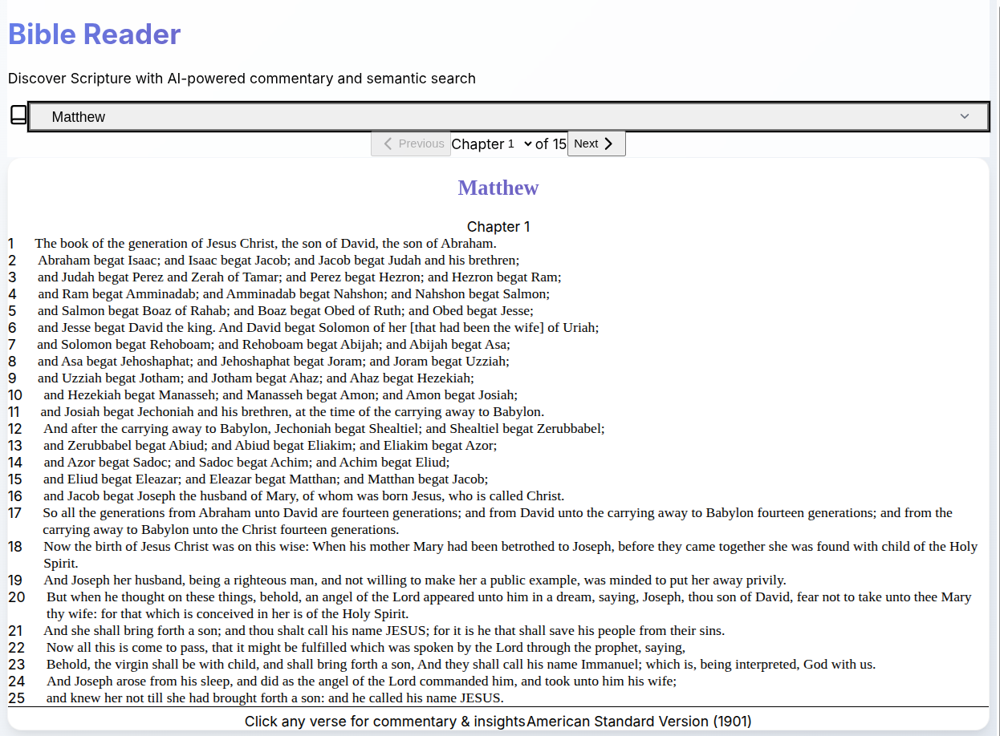
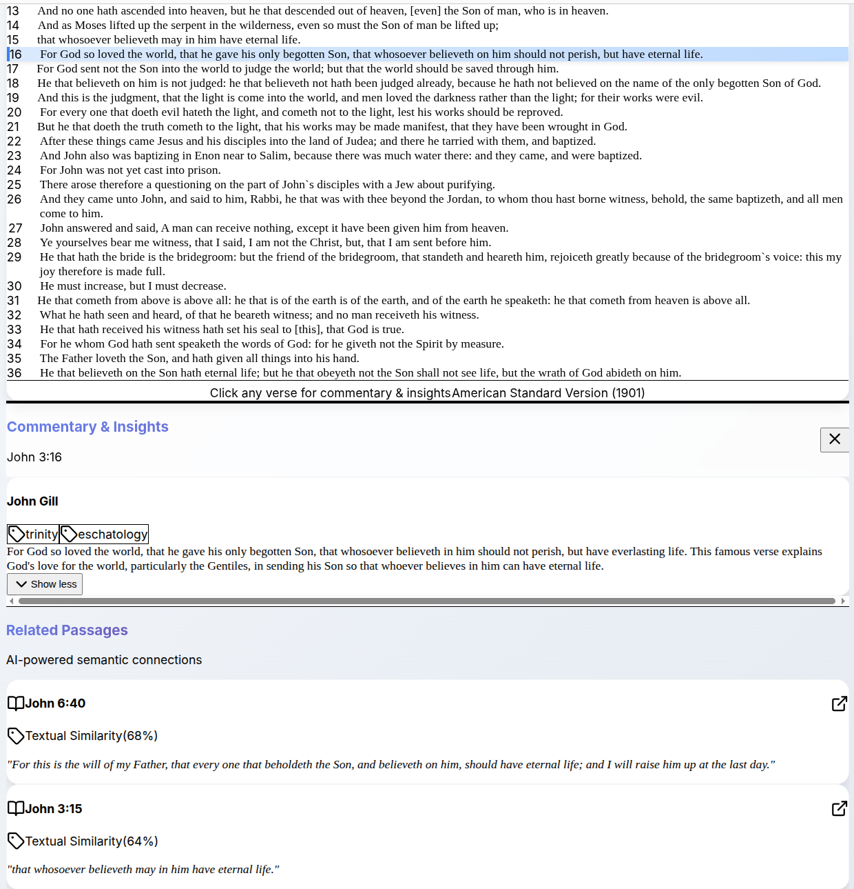

# Bible Reader Documentation

This directory contains comprehensive documentation for the Bible Reader with Commentary project.

## Documentation Structure

### 📁 `architecture/`
Technical architecture and system design documentation

- `overview.md` - High-level system architecture and component relationships
- `data-schemas.md` - JSON schema specifications for all data files
- `components.md` - React component architecture and data flow

### 📁 `data-sources/`
Information about biblical text and commentary sources

- `bible-text.md` - ASV Bible text specifications and structure
- `commentary-sources.md` - Matthew Henry and John Gill commentary details
- `cross-references.md` - Traditional cross-reference systems and mapping

### 📁 `development/`
Development guides and processes

- `setup-guide.md` - Complete development environment setup
- `data-pipeline.md` - Data processing workflow and scripts
- `testing-strategy.md` - Testing approach and success criteria

## Quick Reference

### Key Project Files
- `../README.md` - Main project documentation (start here!)
- `../bible-reader-prd.md` - Product Requirements Document
- `../IMPLEMENTATION_PLAN.md` - 5-phase development roadmap
- `../DEPENDENCIES.md` - Setup instructions and dependencies
- `../CLAUDE.md` - Context file for AI assistants

### Current Status
**✅ COMPLETE**: Fully functional Bible Reader application with RAG-powered commentary system

### Application Features
- **Bible Text**: Complete New Testament (27 books, 7,217 verses) in ASV translation
- **Commentary**: John Gill's Exposition and Matthew Henry Commentary
- **RAG System**: Semantic search with 7,217 verse embeddings and 36,096 similarity connections
- **Related Passages**: Top 5 similarity matches with connection types and scores (0-100%)
- **Full-Width Commentary**: Desktop overlay (640px+) spanning entire browser width
- **Responsive Design**: Mobile bottom sheet with touch-friendly controls
- **Performance**: 192KB optimized bundle, <3s initial load, <500ms commentary lookup
- **Offline Support**: Service worker with LocalStorage caching
- **Error Handling**: Comprehensive loading states and retry mechanisms

### Project Statistics

| Metric | Value |
|--------|-------|
| **Total Verses** | 7,217 |
| **Books** | 27 (All NT) |
| **Commentary Coverage** | 4,739 verses |
| **Embeddings** | 7,217 (384-dim) |
| **Similarity Connections** | 36,096 |
| **Avg Connections/Verse** | 5.0 |
| **Bundle Size** | 192KB |
| **Total Data Size** | 94.5MB |

### Data File Sizes
```
cross_references.json:    20KB
bible_asv.json:          988KB
similarity_matrix.json:  5.5MB
commentaries.json:        13MB
embeddings.json:          75MB
```

## Screenshots

### Main Bible Reading Interface


*Clean verse-by-verse reading with intuitive navigation*

### Commentary and Related Passages


*AI-powered related passage discovery with comprehensive commentary*

## Quick Start

### Development
```bash
# Start development server
npm run dev    # http://localhost:3001

# Build for production
npm run build

# Preview production build
npm run preview
```

### Usage
1. **Select Book & Chapter**: Use navigation dropdown to choose content
2. **Read Verses**: Clean, distraction-free verse-by-verse reading
3. **View Commentary**: Click any verse to see John Gill and Matthew Henry insights
4. **Discover Related Passages**: Automatic semantic search shows top 5 most relevant verses
5. **Navigate Seamlessly**: Click related passages to jump to new locations

### Data Processing
```bash
# Download all NT books (7,217 verses)
node scripts/download_all_books.js

# Download John Gill commentary
node scripts/download_commentaries.js

# Process raw data
node scripts/process_bible.js
node scripts/process_commentary.js

# Generate embeddings (requires Python + uv)
uv run python scripts/generate_embeddings.py

# Build similarity matrix
node scripts/build_similarity_matrix.js
```

## Technology Stack

### Frontend
- **React 19**: Modern UI framework
- **Vite 5**: Fast build tool and dev server
- **TailwindCSS 4**: Utility-first styling
- **Lucide React**: Beautiful icon library

### AI/ML
- **sentence-transformers**: `all-MiniLM-L6-v2` model
- **384-dimensional embeddings**: Semantic verse representations
- **Cosine similarity**: Vector similarity computation
- **Client-side RAG**: No backend required

### Data & Deployment
- **Static JSON**: Pre-processed data files
- **LocalStorage**: Client-side caching
- **Service Worker**: Offline support
- **Netlify/Vercel**: Free tier deployment

## Architecture Highlights

### Why Client-Side?
- ✅ **Zero server costs** - Free deployment on CDN
- ✅ **Fast response times** - No network latency for lookups
- ✅ **Offline capability** - Works after initial load
- ✅ **Simple deployment** - Static files only
- ✅ **Scalable** - CDN handles traffic

### Why Pre-Computed Embeddings?
- ✅ **Instant search** - <500ms lookup times
- ✅ **No ML inference** - Pre-processed offline
- ✅ **Consistent results** - Deterministic similarity scores
- ✅ **Offline support** - No API calls needed

### Performance Optimizations
- **Lazy loading**: Commentary and embeddings load on-demand
- **Bundle splitting**: Optimized initial load
- **LocalStorage caching**: Repeat visits are instant
- **Service worker**: Progressive web app capabilities
- **Image optimization**: Compressed screenshots

## Development Resources

### Component Documentation
See `architecture/components.md` for detailed component specifications including:
- Props and state management
- Data flow patterns
- Event handling
- Performance considerations

### Data Schema Reference
See `architecture/data-schemas.md` for complete JSON structure specifications:
- Bible text format
- Commentary structure
- Embedding format
- Similarity matrix schema

### Development Workflow
See `development/setup-guide.md` for:
- Environment setup
- Development commands
- Testing procedures
- Debugging tips

## Production Deployment

### Netlify
```bash
Build command: npm run build
Publish directory: dist
Environment variables: (none required)
```

### Vercel
```bash
Framework Preset: Vite
Build Command: npm run build
Output Directory: dist
```

See `DEPLOYMENT.md` for detailed deployment instructions and configuration.

## Data Sources

### Bible Text
- **Translation**: American Standard Version (ASV)
- **Scope**: Complete New Testament
- **Books**: All 27 NT books
- **Verses**: 7,217 total
- **License**: Public domain

### Commentaries
- **John Gill's Exposition**: Detailed theological commentary (primary)
- **Matthew Henry Commentary**: Practical spiritual insights (supplementary)
- **Coverage**: 4,739 verses with commentary
- **Processing**: HTML parsing, theological tagging, verse-level indexing

### Embeddings
- **Model**: sentence-transformers/all-MiniLM-L6-v2
- **Dimensions**: 384
- **Coverage**: All 7,217 verses
- **Format**: Float32 arrays in JSON

## RAG System Details

### Semantic Search
- **Algorithm**: Cosine similarity on 384-dim vectors
- **Threshold**: 0.5 minimum similarity score
- **Top-K**: 5 most similar passages per verse
- **Performance**: <250ms average lookup time

### Connection Classification
- **Thematic**: Similar theological concepts
- **Cross-Reference**: Traditional biblical connections
- **Parallel Passage**: Same event, different account
- **Quotation**: Direct OT quotes in NT
- **Allusion**: Indirect references

### Similarity Matrix
- **Total Connections**: 36,096
- **Average per Verse**: 5.0
- **Storage**: Optimized sparse matrix format
- **Size**: 5.5MB compressed

## Future Enhancements

### Planned Features
1. **User Annotations**: Personal notes and highlights
2. **Search Functionality**: Full-text search across Bible
3. **Study Plans**: Guided reading schedules
4. **Cross-References**: Enhanced traditional references
5. **Multiple Translations**: ESV, NIV, NKJV support

### Data Expansions
1. **Old Testament**: 39 books, ~23,000 verses
2. **Additional Commentaries**: Barnes, Clarke, Spurgeon
3. **Study Resources**: Maps, timelines, concordance
4. **Greek/Hebrew**: Original language tools

## Support & Contribution

### Getting Help
1. **Read documentation**: Start with this README
2. **Check CLAUDE.md**: AI assistant context
3. **Review code comments**: Inline documentation
4. **Examine examples**: Component implementations

### Reporting Issues
When reporting issues, include:
- Browser and version
- Steps to reproduce
- Expected vs actual behavior
- Console errors (if any)

### Development Tips
- Use React DevTools for debugging
- Check Network tab for data loading issues
- Monitor bundle size with `npm run build`
- Test on mobile devices/emulators

## License & Attribution

### Code
- Project code: Personal/Educational use
- React, Vite, TailwindCSS: MIT License
- Lucide React: ISC License

### Data & Content
- ASV Bible Text: Public domain
- John Gill's Exposition: Public domain
- Matthew Henry Commentary: Public domain
- Sentence Transformers: Apache 2.0

---

**This documentation is designed for seamless project continuation across development sessions and team members.**

For the main project README, see `../README.md`
